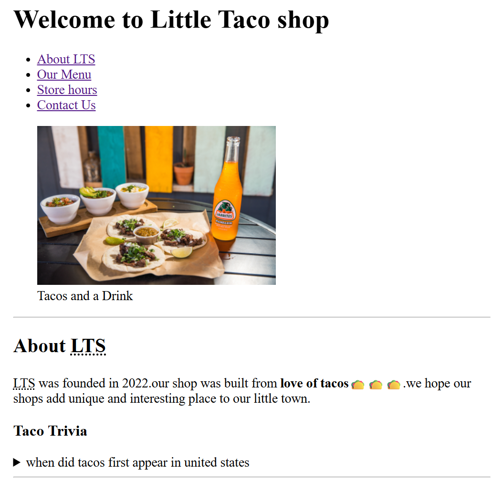
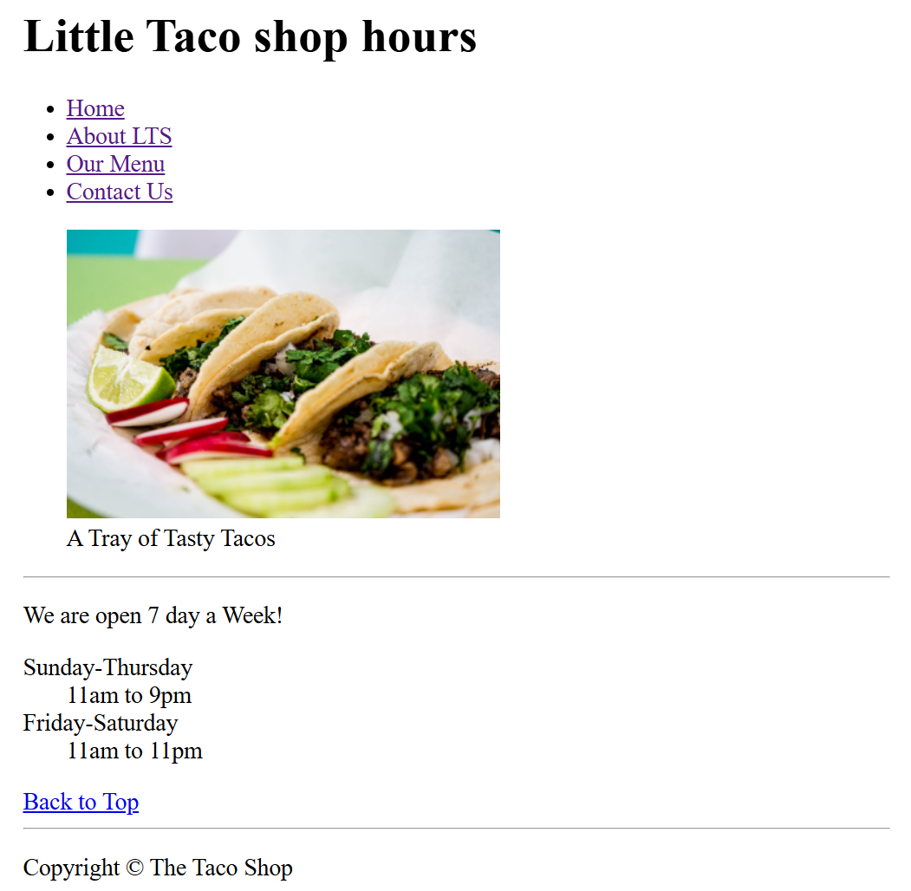
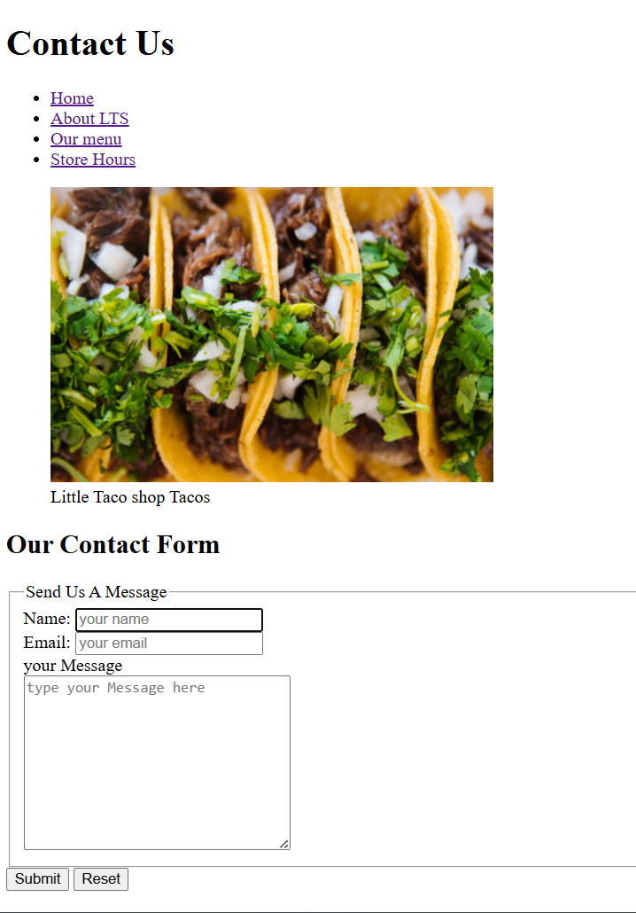

🌮 Little Taco Shop
A beginner HTML project built by following the freeCodeCamp YouTube tutorial. It includes a homepage, store hours page, and contact page for a fictional taco shop.
🔧 Features
- Semantic HTML layout
- Internal navigation with bookmarks
- Menu table and trivia section
- Responsive images and basic metadata
- Contact form page
📁 Files
- home.html — Main page
- hours.html — Store hours
- contact.html — Contact form
- css/style.css — Optional styling
- img/ — Project images
- favicon.ico — Site icon
👨‍💻 Made by Sarvesh Chaudhari
For HTML practice and learning.

## SCREENSHOTS

 

